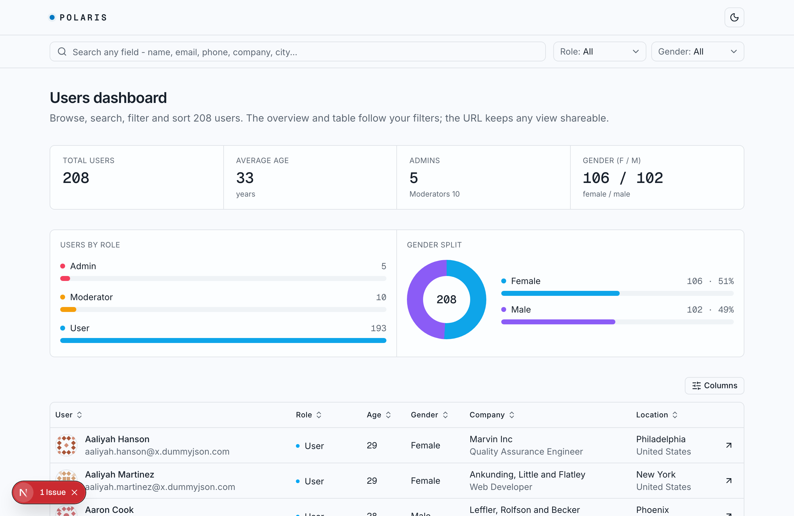
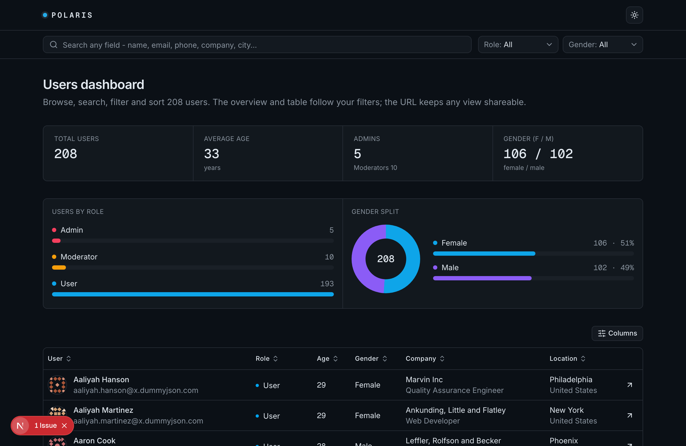
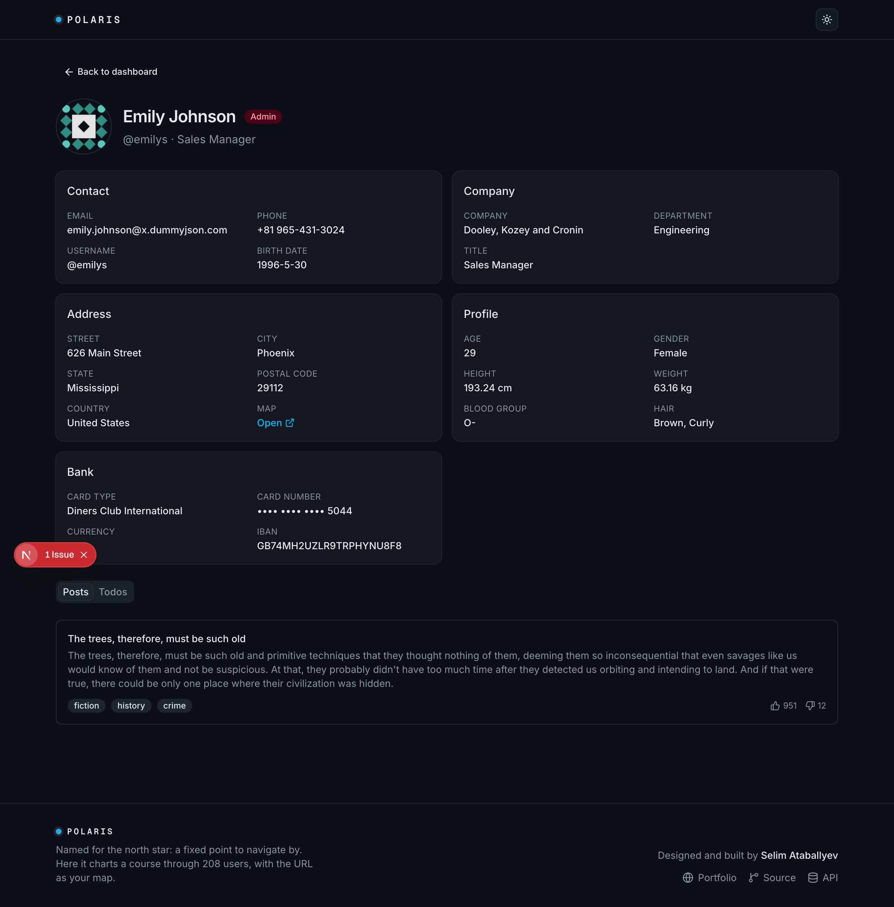
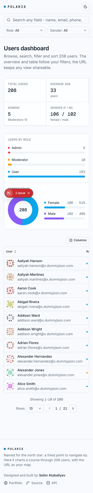

# Capella - Users Dashboard

A users dashboard built on the public [dummyjson](https://dummyjson.com/docs/users)
`/users` API. Browse, search, filter, sort and paginate 208 users, with an
overview that moves with your filters and a detail view per user. The whole
view state lives in the URL, so any slice is shareable.

Live: https://capella.selim.services




## Stack

- **Next.js 16** (App Router, React Server Components) + **TypeScript** (strict)
- **Tailwind CSS v4** + **shadcn/ui** (Base UI)
- **TanStack Table** for the data grid (sorting, column visibility)
- **nuqs** for type-safe URL state
- **zod** for runtime validation at the API boundary
- **Vitest** + Testing Library + **Playwright** for tests
- Deployed to **Cloudflare Workers** via **OpenNext**

## Features

- Server-driven search (every field), role and gender filters, multi-column sort.
- Three-state column sort: initial -> descending -> ascending -> initial.
- Overview (stat strip + role/gender charts) that recomputes from the same
  filtered set as the table.
- Per-user detail page with address, company, masked bank details, and Posts /
  Todos sub-resources streamed with Suspense.
- Every state designed: loading skeletons, error boundary, empty results,
  404 for unknown users, resilient sub-resource failures.
- Light / dark theme with a View Transitions crossfade, full keyboard a11y,
  responsive down to 320px, and CSS-only entrance animations.

## Architecture notes (why it is built this way)

**The URL is the single source of truth.** Server Components read `searchParams`
and render the result; client controls only push to the URL. That makes every
view shareable and bookmarkable, removes a client-side data layer, and means the
back button just works. `nuqs` parsers are defined once and shared by the server
loader and the client controls.

**Fetch once, compose locally.** dummyjson exposes search, filter and sort as
*separate single-axis endpoints* that cannot be combined in one request. The
dataset is also small and bounded (208 users). So I fetch the full list once
server-side, cache it (`revalidate`), and compose search + filter + sort +
pagination together in one pure, unit-tested module (`lib/query.ts`). This gives
full composability and instant interactions. For a large or unbounded dataset I
would push all of this back to the API or a real backend and accept the
single-axis limitation, rather than over-fetch.

**Validated at the boundary.** Every API response is parsed with zod
(`lib/types.ts`), so the rest of the app works against trusted, typed data
instead of `any`. Unknown roles fall back rather than failing the whole parse.

**Charts are pure CSS/SSR.** The role bars and gender donut are plain CSS
(flex widths + `conic-gradient`), animated with `@property`. No charting library,
so they paint with the first server response, ship zero client JS, and stay
crisp. The count-up numbers are an animated CSS counter, so they start in sync
with the mount reveal with no hydration delay or flash.

## Getting started

```bash
npm install
npm run dev          # http://localhost:3000
```

Other scripts:

```bash
npm run build        # production build
npm run lint         # eslint
npm run typecheck    # tsc --noEmit
npm test             # vitest (unit + component)
npm run test:e2e     # playwright
npm run preview      # build + run on Cloudflare Workers locally (OpenNext)
npm run deploy       # build + deploy to Cloudflare
```

## Tests

- Unit: the query layer (search / filter / sort / paginate / stats) and the URL
  param normaliser.
- Component: zod schema parsing and the stat overview rendering.
- E2E: search updates the URL and filters, sorting reflects in the URL, and
  opening a user reaches the detail page.

## Project shape

```
app/                  routes, layouts, loading/error/not-found
components/dashboard/  table, filters, charts, stat strip, pagination
components/users/      role badge, info card, posts/todos
lib/                   api client + zod, query layer, URL params, formatting
tests/                 unit / component / e2e
```



